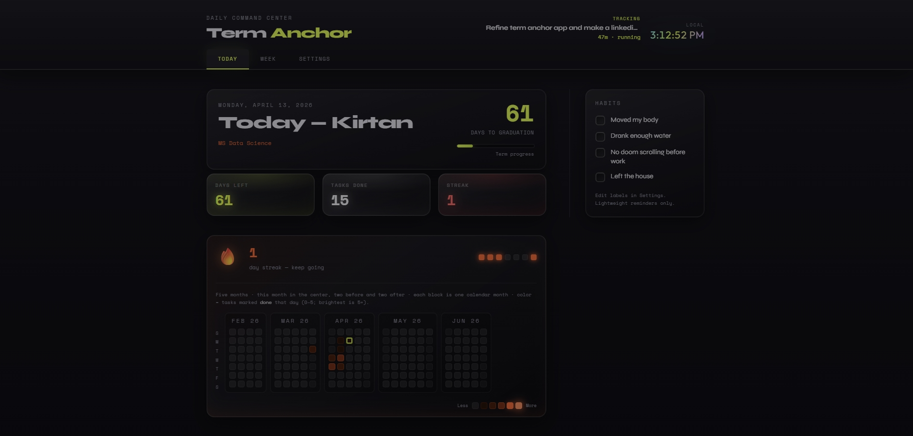
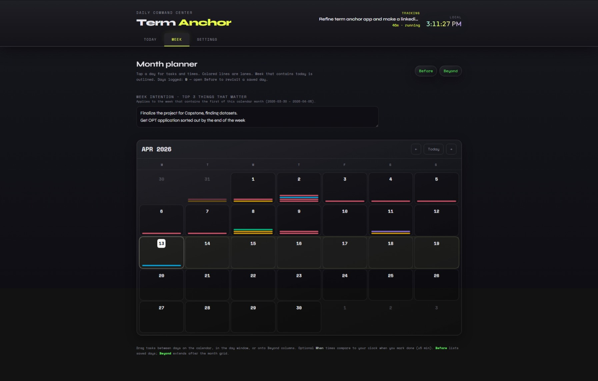
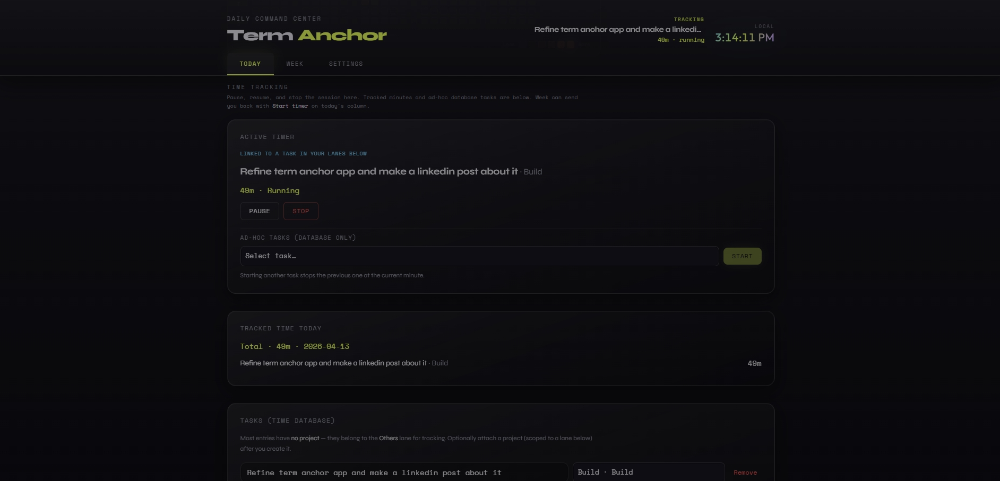
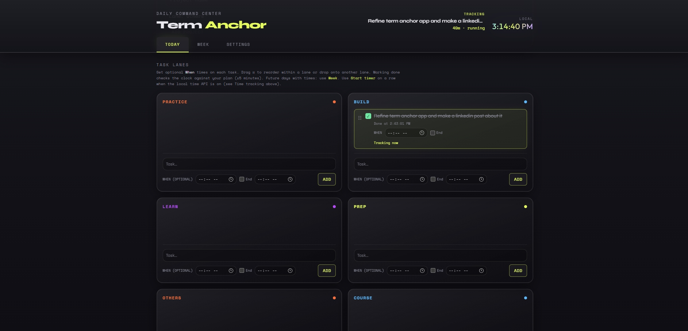
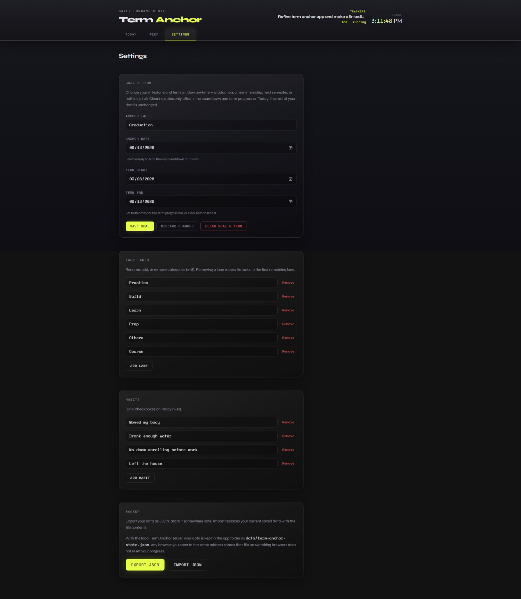

# Term Anchor

> **A local-first daily command center for students.**
> Track tasks, time, habits, and your whole term — all on your own machine. No accounts. No cloud. No subscription.



---

## What is Term Anchor?

Term Anchor is a personal productivity web app built for students juggling coursework, projects, and everything in between. It gives you one place to plan your week, track your time, build habits, and log your day — and everything stays on your computer.

**Why local-first?** Your data is yours. It lives in a file next to the app, not on someone else's server. You can back it up, move it, or delete it whenever you want.

---

## Getting Started

> **Requirement:** [Node.js 18+](https://nodejs.org/) (LTS recommended). That's the only thing you need to install.

### Windows

1. Install [Node.js](https://nodejs.org/) if you haven't already
2. Clone or download this repo
3. Double-click **`Start-TermAnchor.cmd`**

That's it. On first run it automatically installs dependencies and builds the app, then opens it in your browser. Leave the terminal window open while you use the app.

> **Want a specific browser?** After the server is running, right-click **`Open-Term-Anchor.url`** → Open with → pick your browser.

---

### macOS

1. Install [Node.js](https://nodejs.org/) if you haven't already
2. Clone or download this repo
3. Open Terminal in the project folder and run:

```bash
chmod +x start-term-anchor.command
```

4. Double-click **`start-term-anchor.command`**

Your default browser will open the app after a few seconds.

---

### Linux (or manual setup on any OS)

1. Install [Node.js](https://nodejs.org/) if you haven't already
2. Clone the repo:

```bash
git clone https://github.com/bdk-333/Term-Anchor.git
cd Term-Anchor
```

3. Install and build:

```bash
npm install
npm run build
npm start
```

4. Open your browser and go to **http://127.0.0.1:8787/**

---

### Development mode

If you want to run with hot reload (changes reflect instantly):

```bash
npm install
npm run dev
```

---

## Screenshots

| Today — Home | Week — Month Planner |
|---|---|
|  |  |





---

## Features

### Today (Home)
Your daily hub. Everything you need for the current day in one scrollable view.

- **Countdown** to your anchor date (graduation, internship, next semester — whatever matters to you)
- **Term progress bar** showing how far through the term you are
- **Streak heatmap** — a five-month contribution-style grid (like GitHub's activity graph) showing tasks completed per day, on an orange intensity scale
- **Habits** — daily checkboxes you define in Settings (moved my body, drank enough water, etc.)
- **Task lanes** — renameable categories (Practice, Build, Learn, Course, etc.) with tasks you can add, check off, and time
- **Time tracking** — a live timer tied to your lanes and tasks, with daily totals stored in a local SQLite database
- **Today's intention** — a free-text focus statement for the day
- **Daily log** — sectioned notes with three modes: Cornell, outline, or boxed. Supports drag reorder and file attachments

---

### Week (Month Planner)
A Monday-start monthly calendar that shows your task load at a glance.

- **Lane-colored bars** on each day show which categories have tasks scheduled
- **Tap any day** to open a detail modal — see all tasks, add new ones with optional times, and drag tasks between days
- **Week intention** — a top-3 priorities note for the week
- **Before** — revisit saved past days
- **Beyond** — plan days beyond the current month grid

---

### Settings
Customize everything without touching code.

- Set or change your **anchor date and term window** at any time
- **Add, rename, or remove task lanes** (2–8 lanes supported)
- **Add or remove habits**
- **Export / Import JSON** to back up and restore your planner data

> For a full backup including time tracking, also copy `data/time-tracking.db`.

---

## Where Your Data Lives

| Data | Location | Notes |
|---|---|---|
| Planner (tasks, habits, logs) | `data/term-anchor-state.json` | Shared across all browsers at the same address |
| Time tracking | `data/time-tracking.db` | SQLite via sql.js (WASM) — no native compiler needed |
| Static fallback | Browser `localStorage` | Used only if running without the Node server |

---

## Tech Stack

| | |
|---|---|
| **Frontend** | React, TypeScript, Vite, Tailwind CSS v4 |
| **Routing** | React Router |
| **Drag & Drop** | @dnd-kit |
| **Dates** | date-fns |
| **Database** | SQLite via sql.js (WebAssembly) |
| **Server** | Node.js (custom, no framework) |
| **Tests** | Vitest |
| **Built with** | Cursor + Claude Sonnet |

---

## Running Tests

```bash
npm test
```

Covers streak helpers, storage logic, and migration utilities in `src/lib`.

---

## Roadmap for Future

- [ ] Commute / day-type planner
- [ ] Life & exploration list (bucket-style places and events)

---

## License

MIT — clone it, use it, change it however you want.

